# Detailed analysis for dataset `ascad_v1_fk_100` ...

## Train and attack for `original`

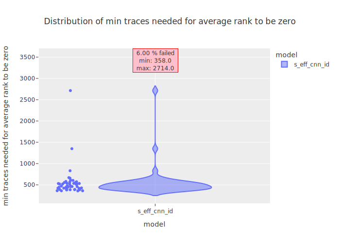

|s_eff_cnn_id  **6.00 % FAILED** |
|---|
|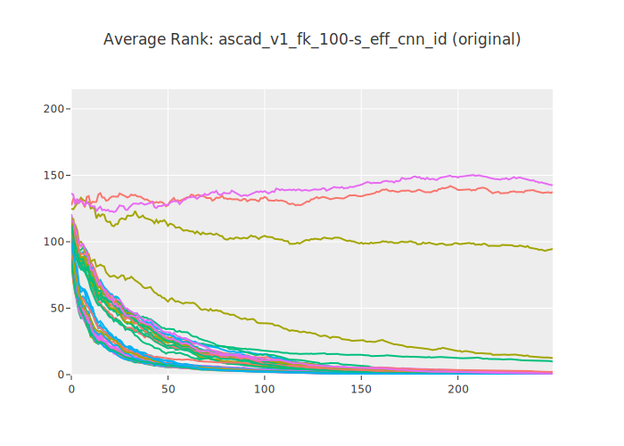|
|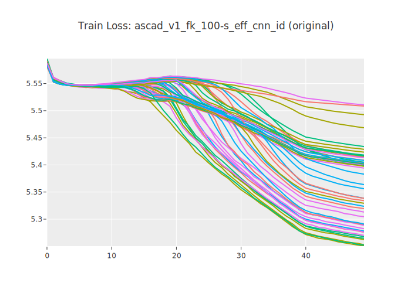|
|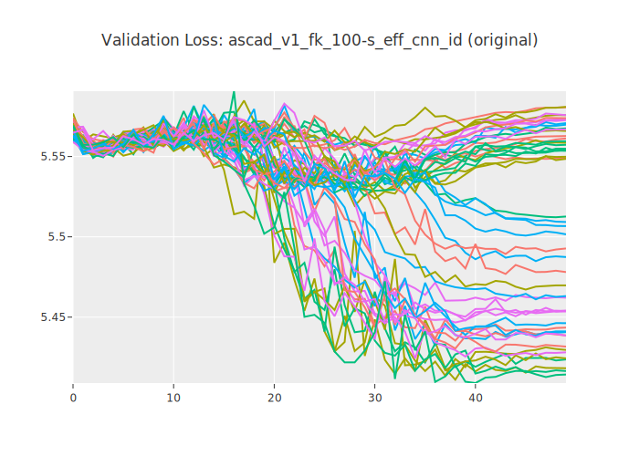|
|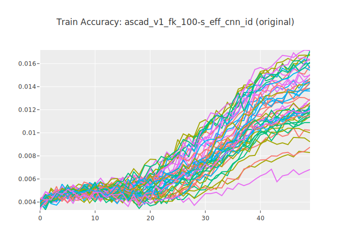|
|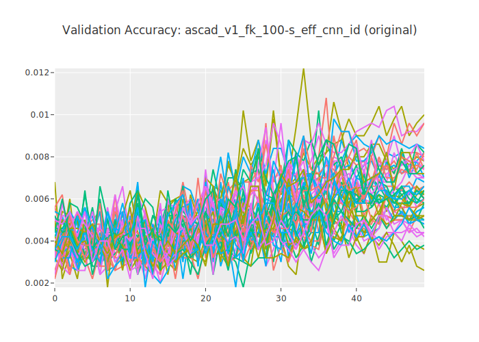|

## Train and attack for `early_stopping`

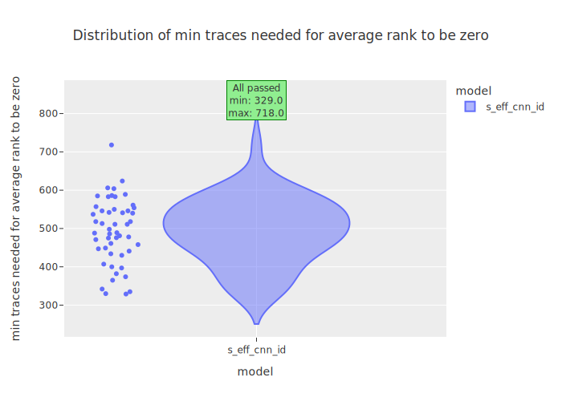

|s_eff_cnn_id  **ALL PASSED** |
|---|
|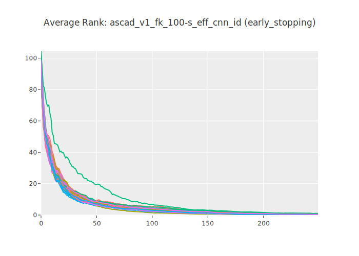|
|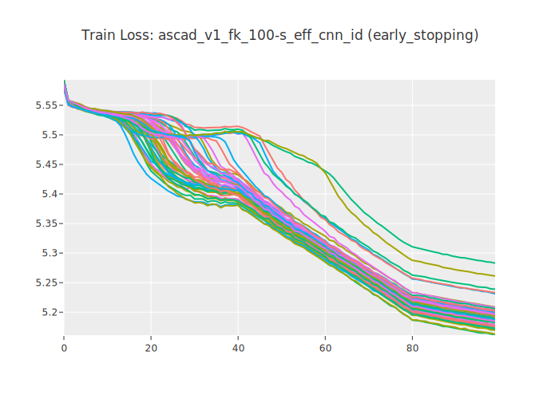|
|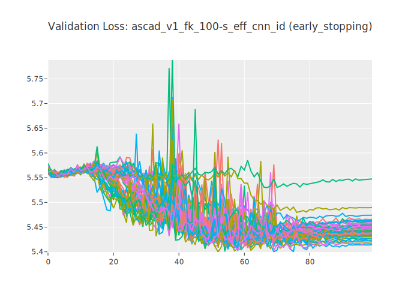|
|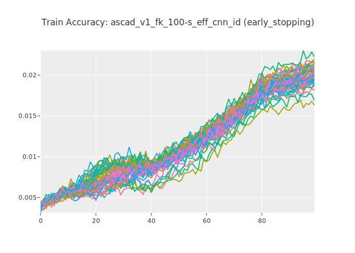|
|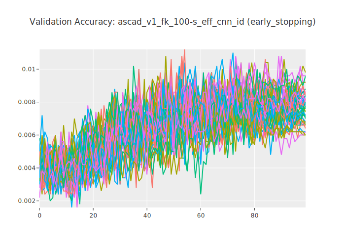|