# Dataset dpav4: Analysis of 100 experiments

## Original (i.e. without early stopping)

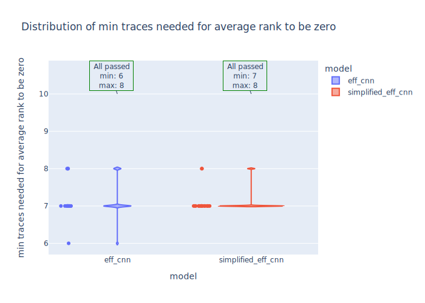

|eff_cnn  **ALL PASSES** |simplified_eff_cnn  **ALL PASSES** |
|---|---|
|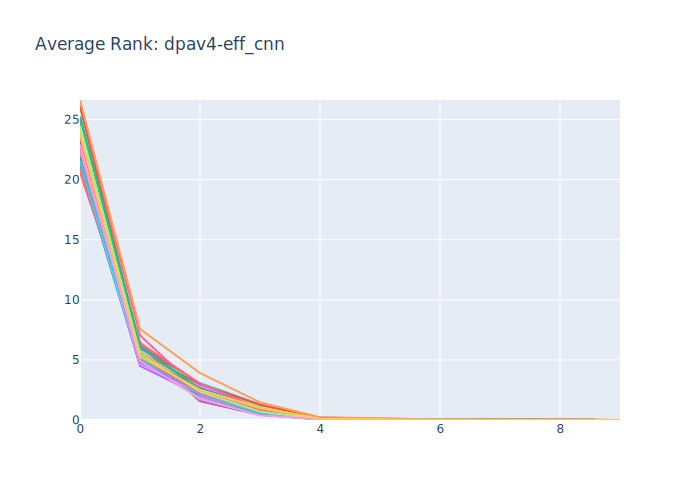|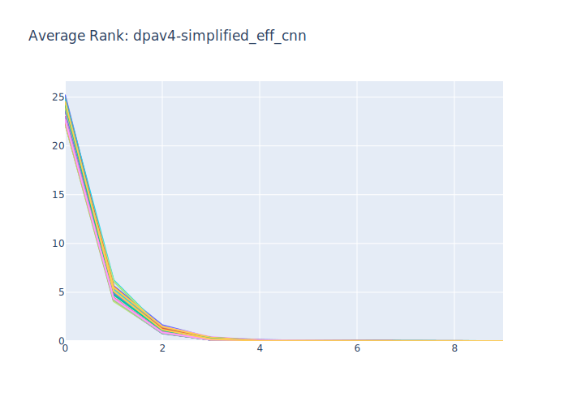|
|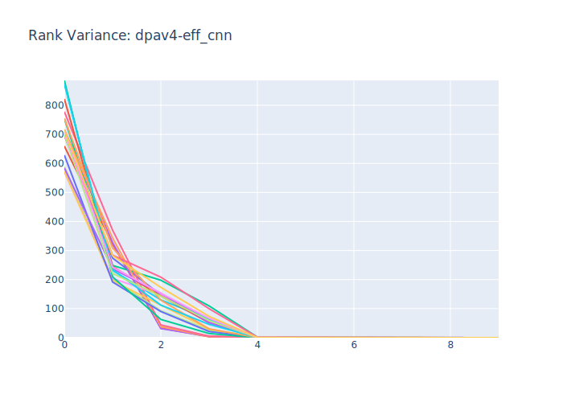|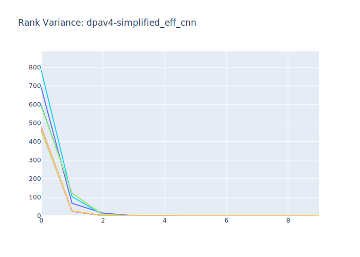|
|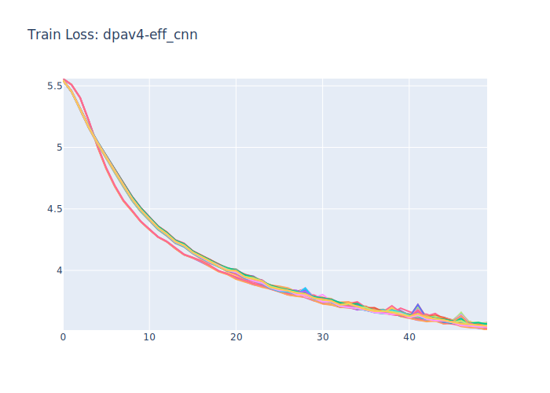|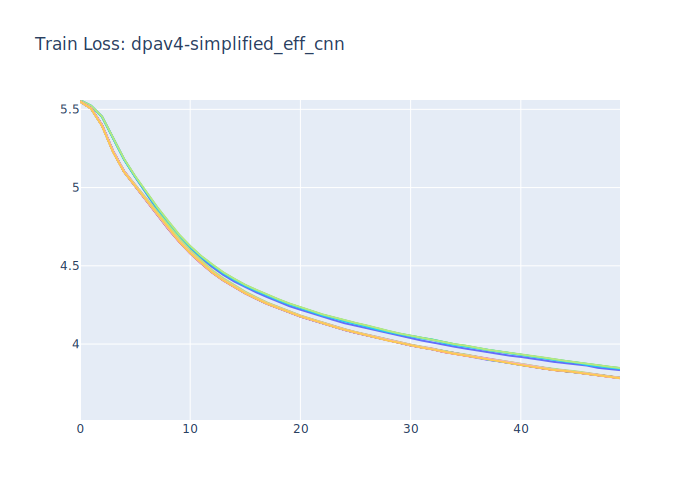|
||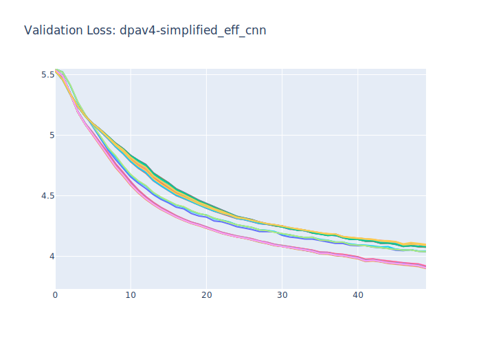|
## Modified original to work with early stopping

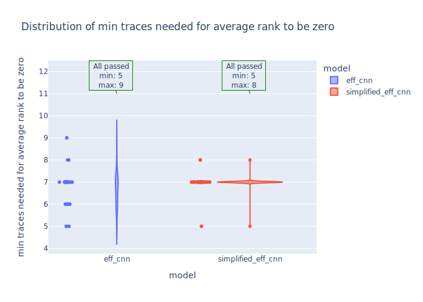

|eff_cnn  **ALL PASSES** |simplified_eff_cnn  **ALL PASSES** |
|---|---|
|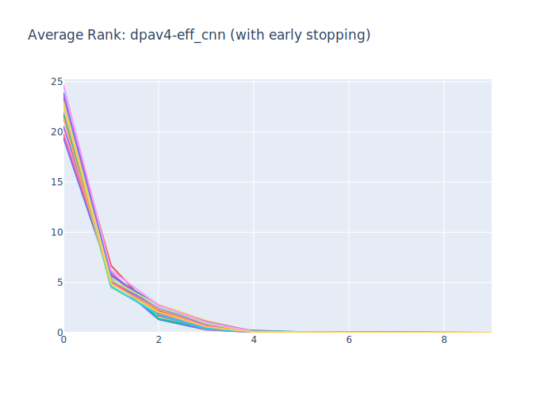|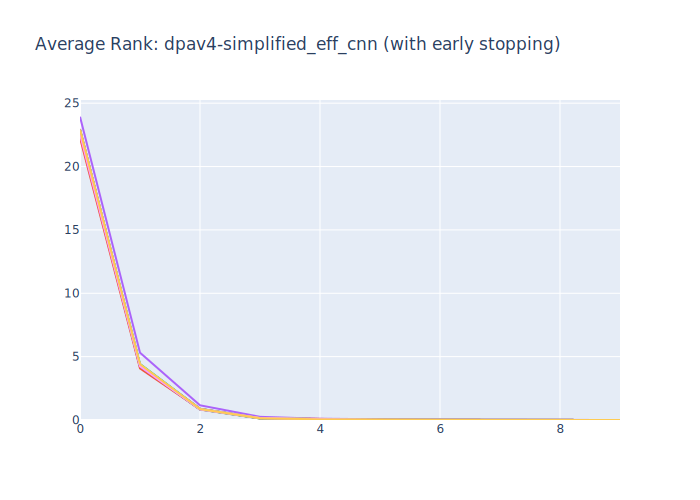|
|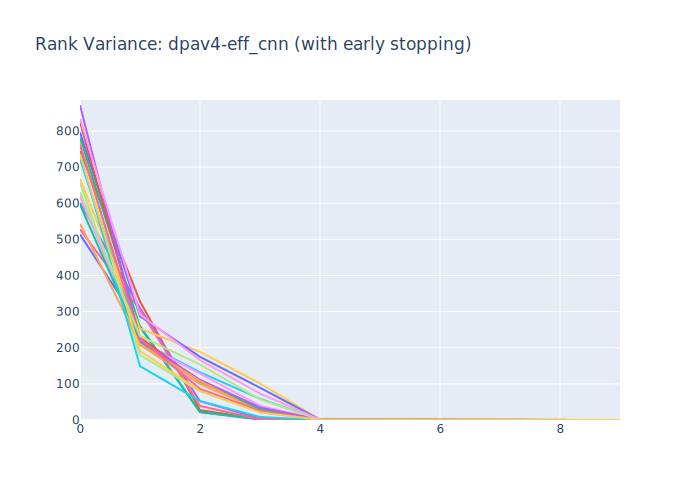|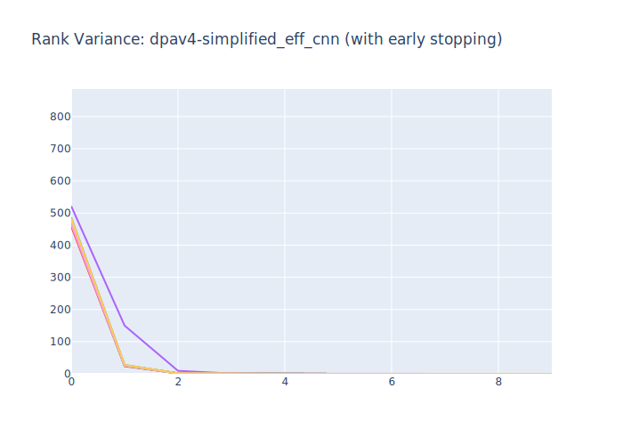|
|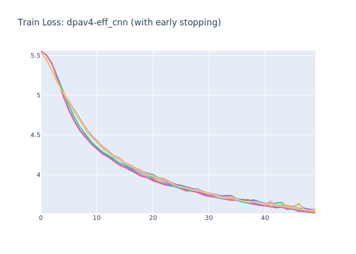|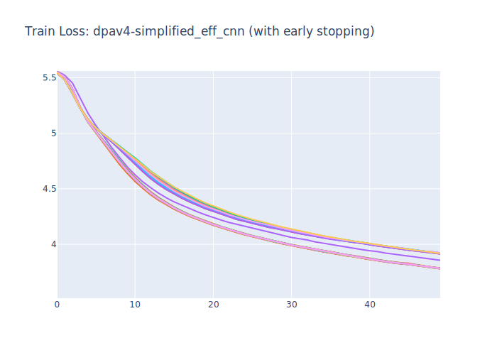|
|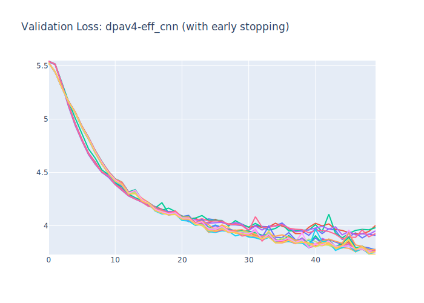|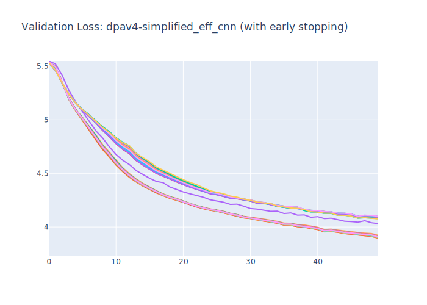|