# Detailed analysis for dataset `ascad_v1_vk_0_noisy` ...

## Train and attack for `original`

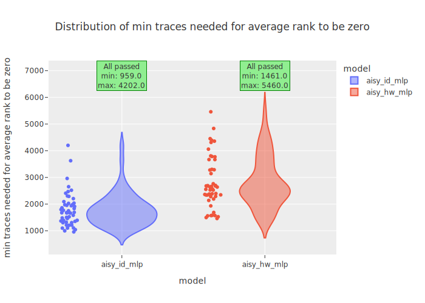

|aisy_id_mlp  **ALL PASSED** |aisy_hw_mlp  **ALL PASSED** |
|---|---|
|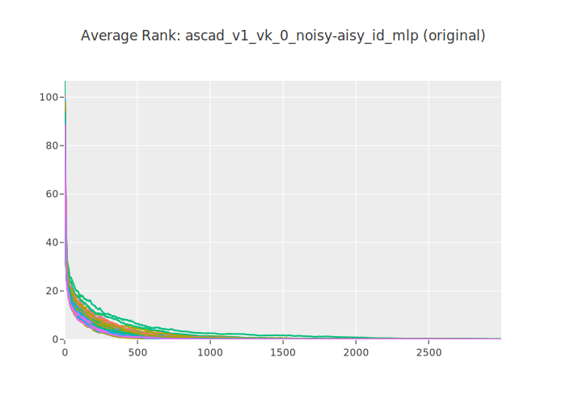|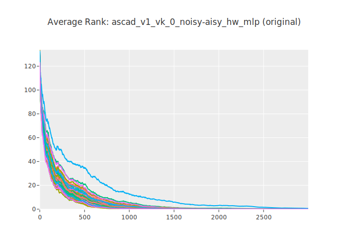|
|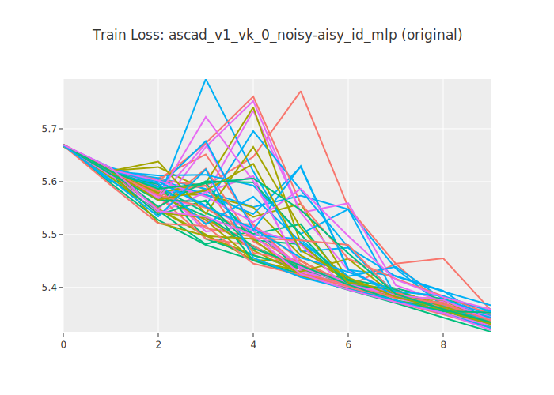|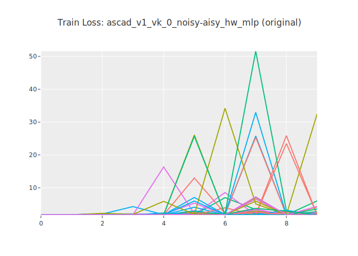|
|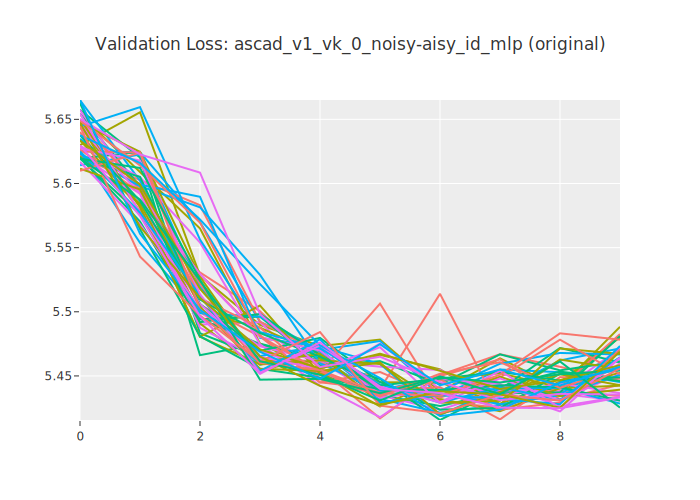|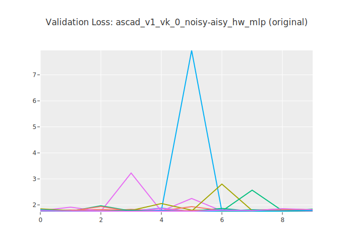|
|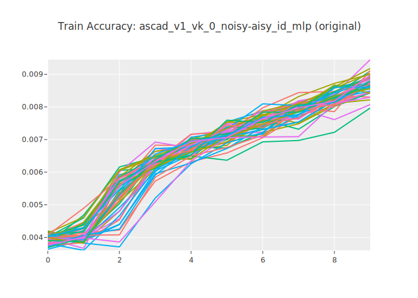||
|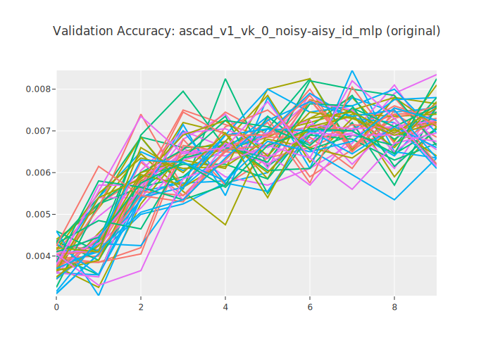||

## Train and attack for `early_stopping`

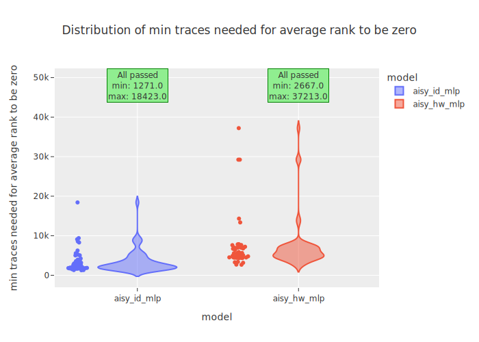

|aisy_id_mlp  **ALL PASSED** |aisy_hw_mlp  **ALL PASSED** |
|---|---|
|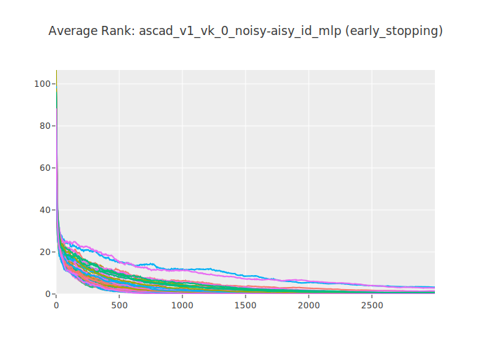|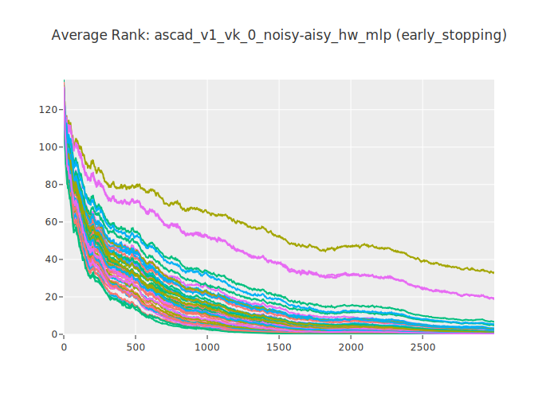|
|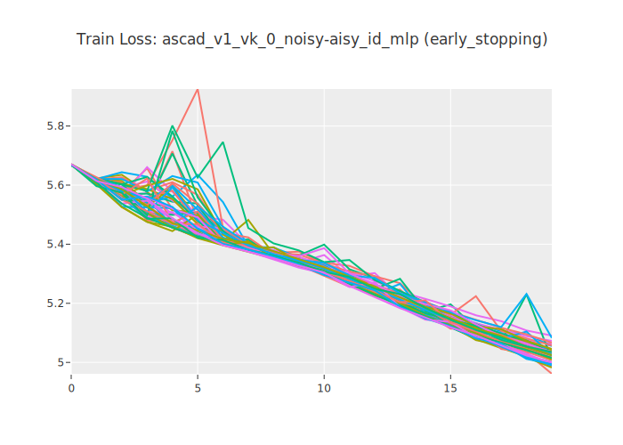|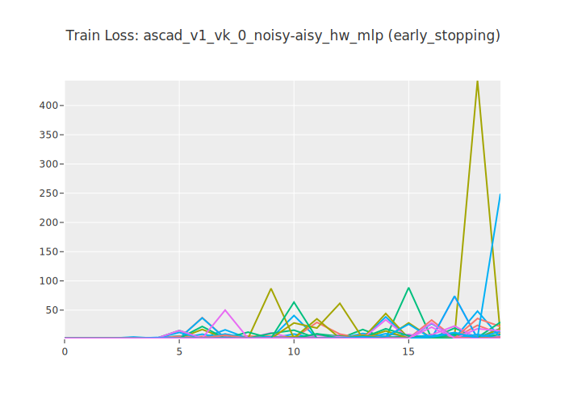|
|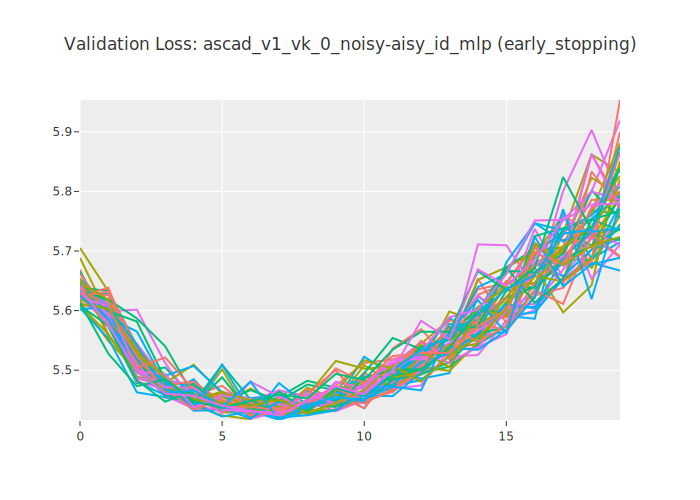|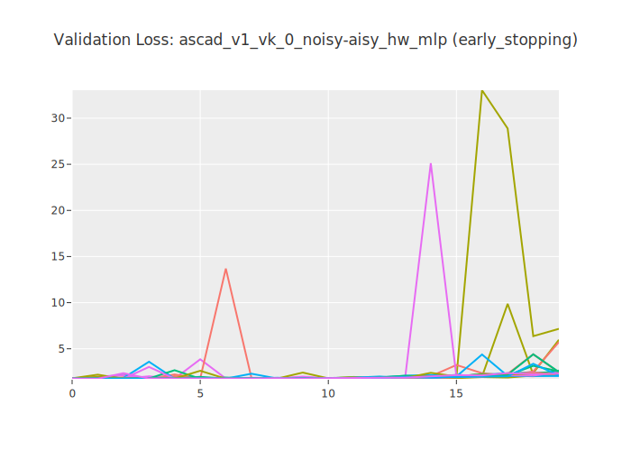|
|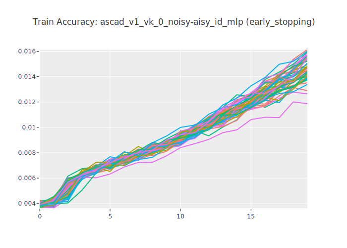|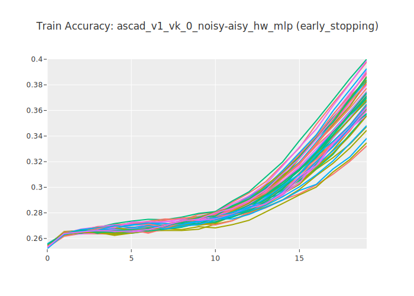|
|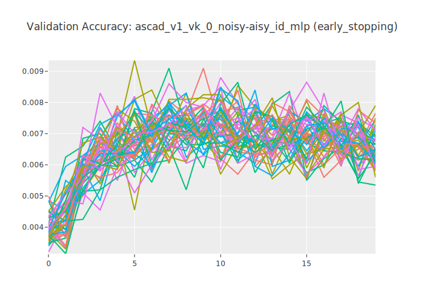|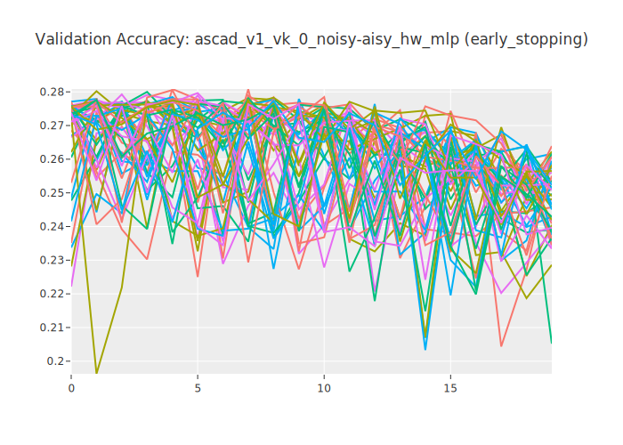|