# Dataset ascad_0: Analysis of 100 experiments

## Original (i.e. without early stopping)

|ascad_mlp  **3.33 % FAILED** |ascad_mlp_fn  **ALL PASSES** |eff_cnn  **ALL PASSES** |simplified_eff_cnn  **ALL PASSES** |
|---|---|---|---|
|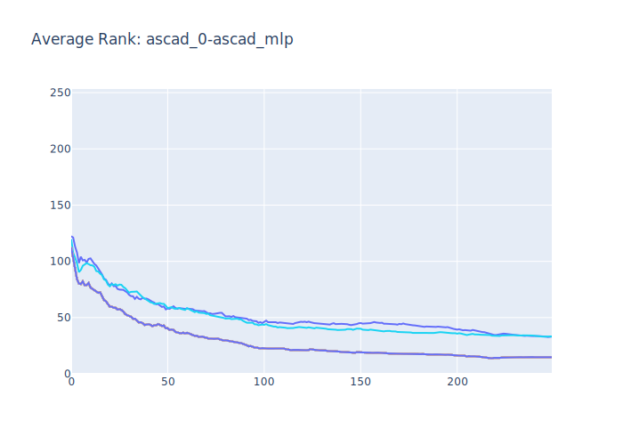|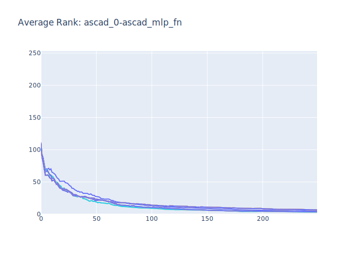|||
|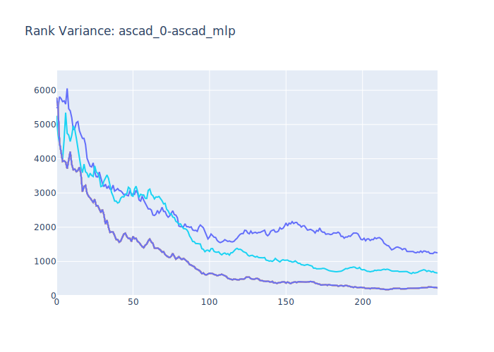|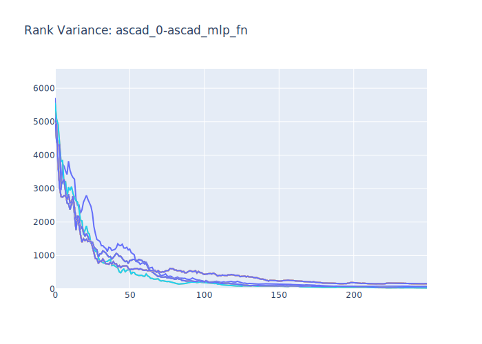|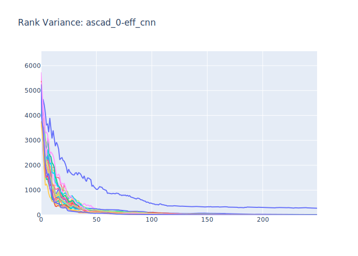|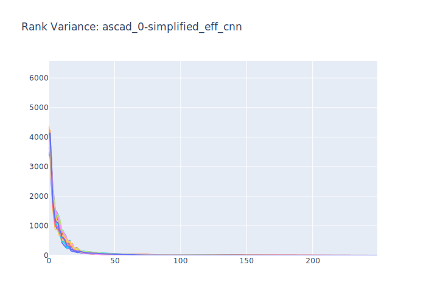|
|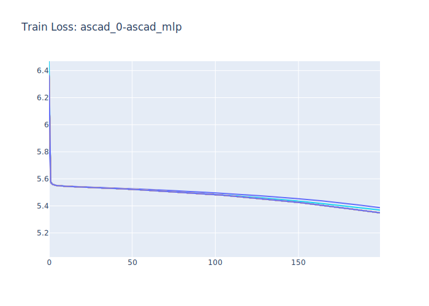|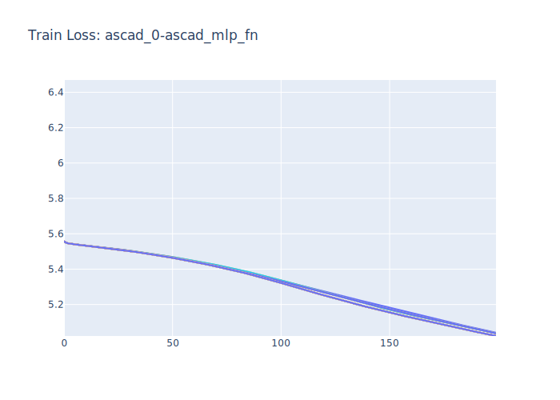|||
|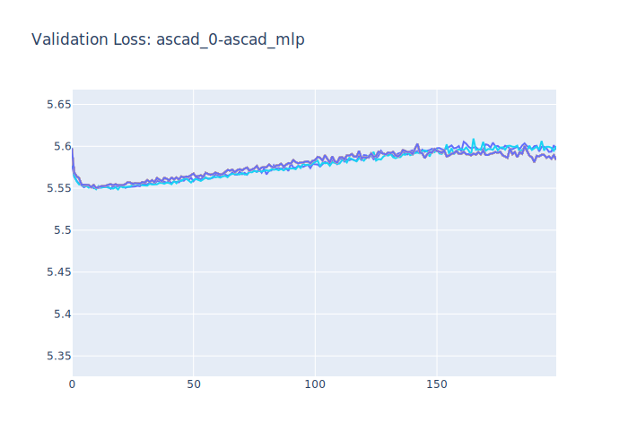|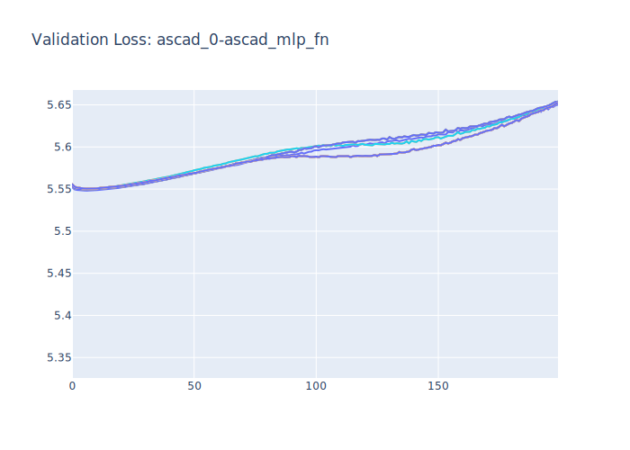|||
## Modified original to work with early stopping

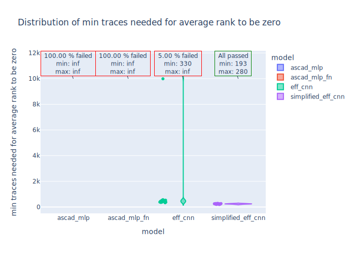

|ascad_mlp  **100.00 % FAILED** |ascad_mlp_fn  **100.00 % FAILED** |eff_cnn  **16.67 % FAILED** |simplified_eff_cnn  **ALL PASSES** |
|---|---|---|---|
|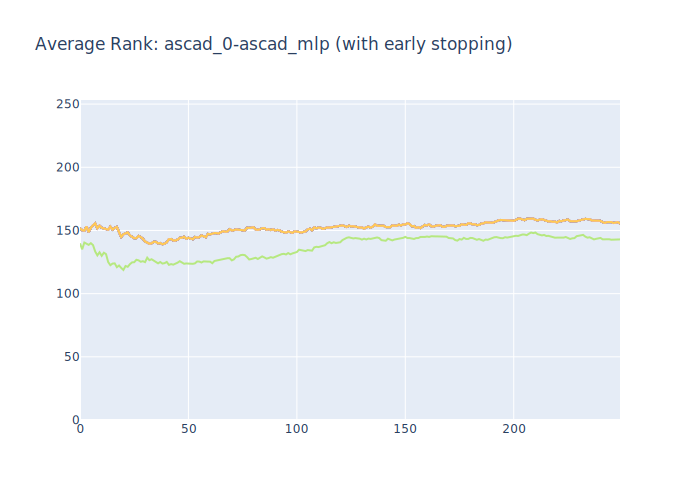|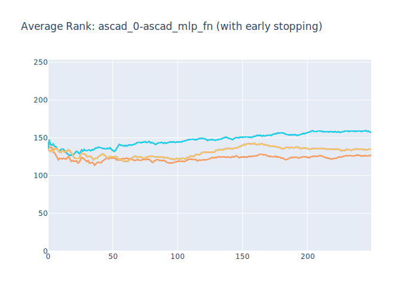|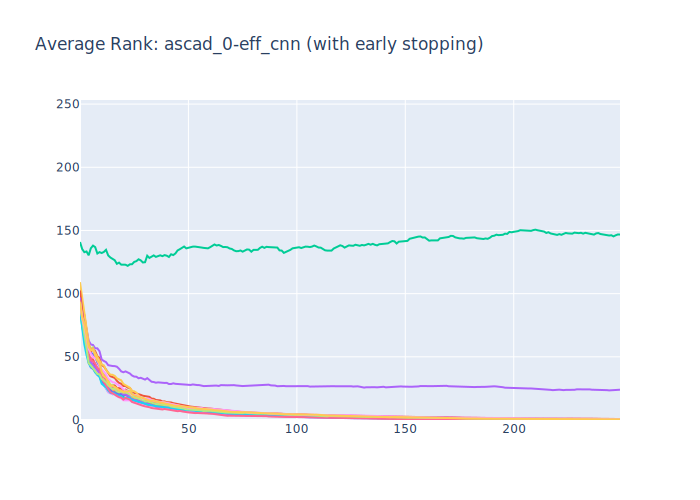|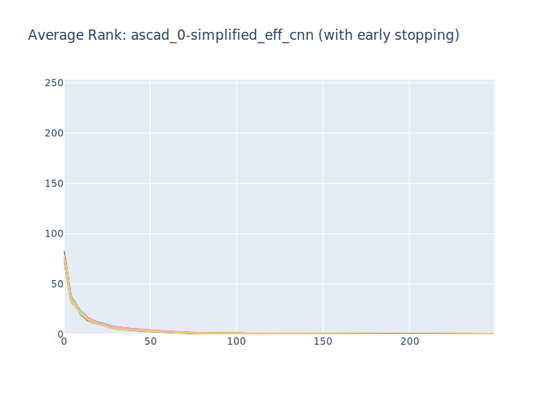|
|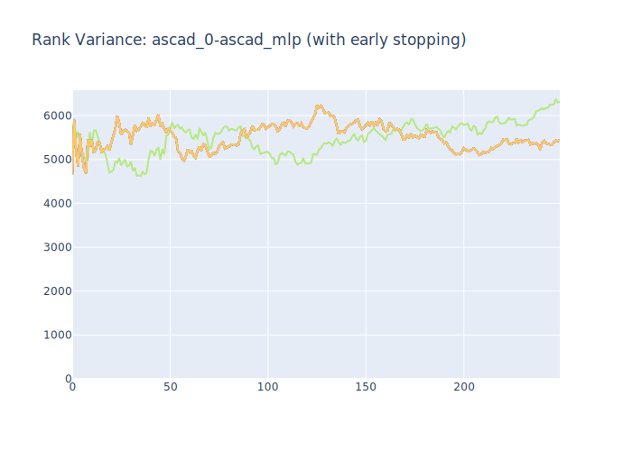|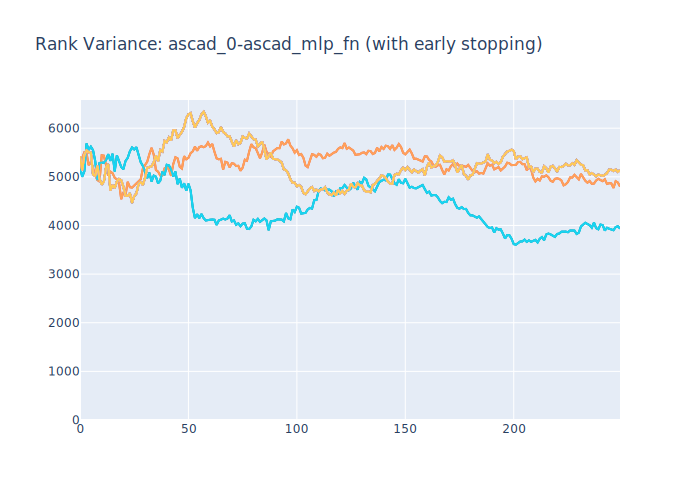|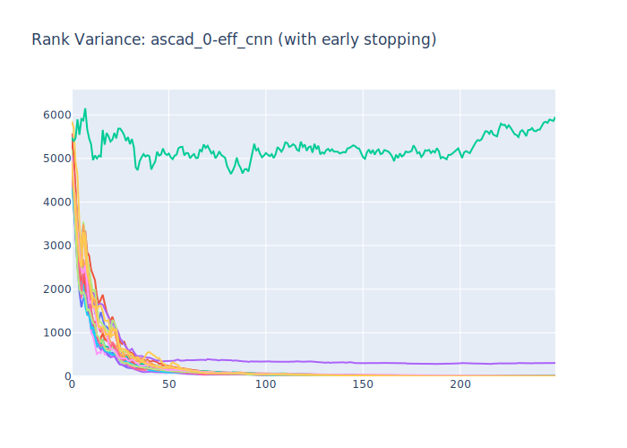|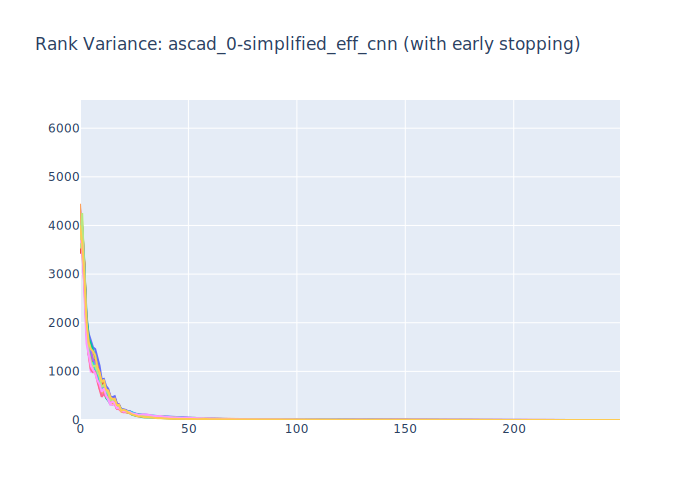|
|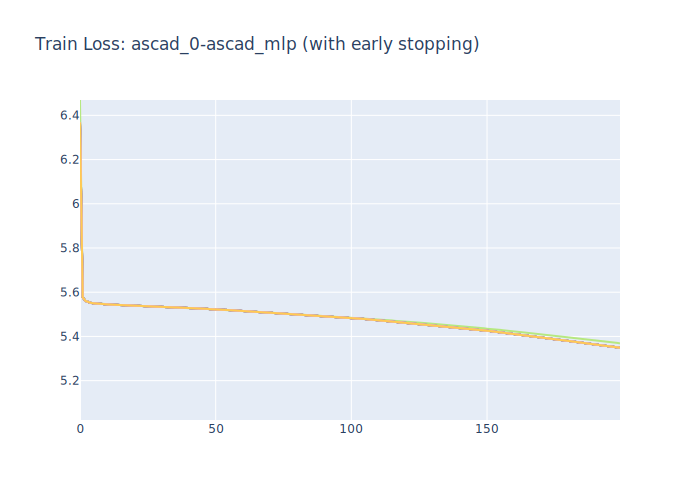|||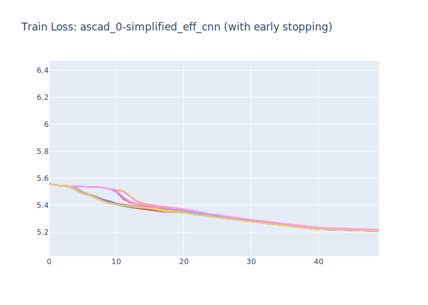|
|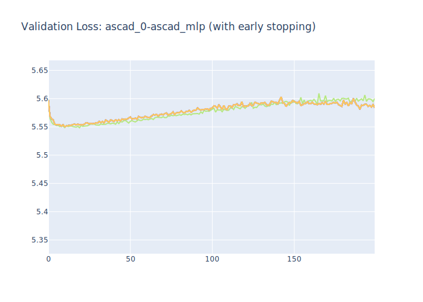|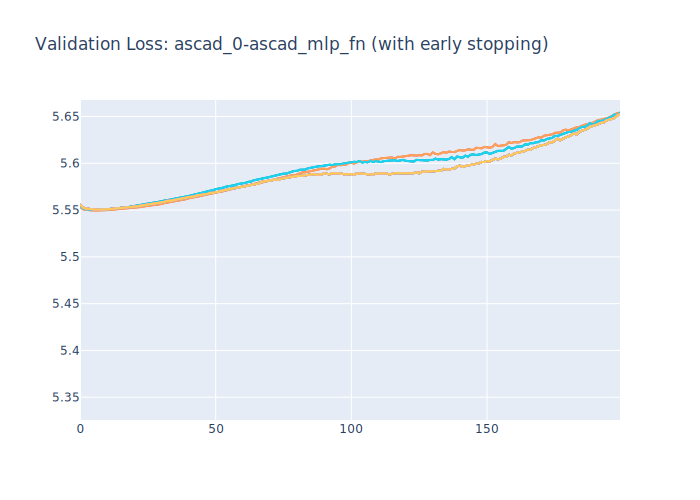|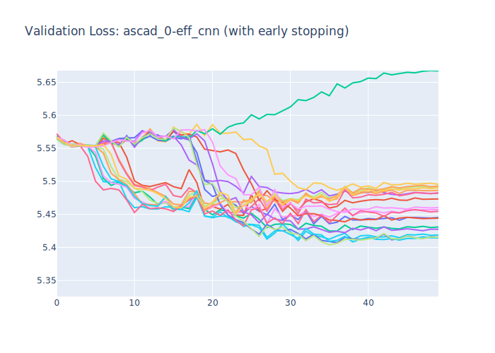|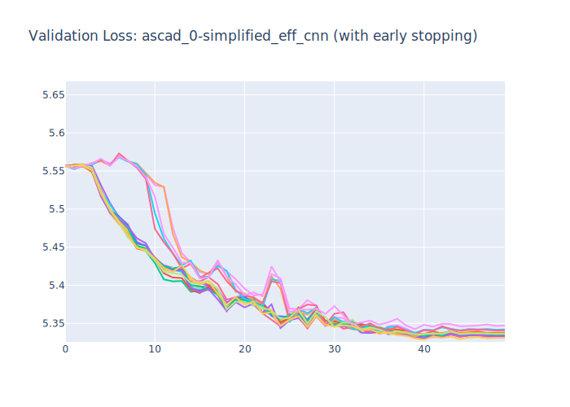|